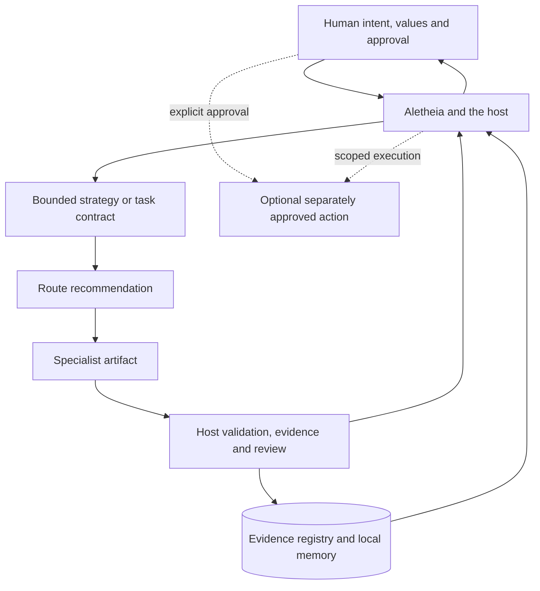

# 14 — Pantheon Bounded Cognition: What I Kept from ACE

> **Status:** Bounded-cognition architecture note and experiment report. This is separate from the later Pantheon Agent Room read-only Hermes Desktop project. Neither is a production system or an autonomous cognitive entity.

**Date:** August 4, 2026<br>
**Status distinction reviewed:** August 16, 2026

I returned to David Shapiro's ACE diagram while reviewing Pantheon. Shapiro's public work was an important early influence on how I thought about autonomous systems. ACE gave me a useful vocabulary for separating values, strategy, self-knowledge, planning, task selection and execution before I had reliable software for any of them.

In my earlier [ACE experiment](07_ace_framework_exploration.md), I translated that separation into Python classes and a message bus. Much of the reasoning was simulated, and the prototype showed that moving text between named layers did not enforce the authority shown in the diagram.

That lesson later shaped Pantheon.

## The sources I compared

I reviewed public, archived snapshots of three projects:

- [ACE Framework at `c6693ee`](https://github.com/daveshap/ACE_Framework/tree/c6693ee2ff547d63675f938a3714165050fd0126)
- [OpenAI Agent Swarm / HAAS at `020b44e`](https://github.com/daveshap/OpenAI_Agent_Swarm/tree/020b44e2f1cc9c767abf5ea3acb69696e394f4ec)
- [Sparse Priming Representations at `5d3d19e`](https://github.com/daveshap/SparsePrimingRepresentations/tree/5d3d19e39bfd222901a5c88d06409b5ef48c1478)

All three repositories are MIT-licensed and archived. I treated them as historical architecture and experiment records, not current production baselines. I inspected the text and selected source files statically; I did not run their code.

The ACE image supplied for this review is pixel-identical to the [architecture image in the pinned repository](https://github.com/daveshap/ACE_Framework/blob/c6693ee2ff547d63675f938a3714165050fd0126/images/ACE%20Framework%20Overall%20Architecture.png). It shows six cognitive layers, a southbound control bus, a northbound telemetry bus and an input/output boundary to the environment.

## Questions I still use from ACE

ACE describes a continuous path:

```text
aspiration
    ↓
global strategy
    ↓
agent model
    ↓
executive function
    ↓
cognitive control
    ↓
task prosecution
    ↓
environment
```

The southbound bus carries mission and instructions. The northbound bus returns state, telemetry, progress and failure. A separate System Integrity overlay is intended to watch components, configuration and models outside the main cognition path.

I still use the model to ask:

- Did the task inherit a real objective or invent one?
- Does the plan fit the system's actual capabilities?
- Which risks and resources constrain execution?
- What evidence returns after an action?
- What should cause a task to stop or switch?

ACE's roadmap also aimed at self-direction, self-modification and increasingly autonomous operation. I no longer assume that more autonomy is the natural measure of progress for my own system.

The strongest public implementation is the [`ACE_PRIME/HelloAF` demonstrator](https://github.com/daveshap/ACE_Framework/tree/c6693ee2ff547d63675f938a3714165050fd0126/ACE_PRIME/HelloAF). It starts components in containers, connects neighbouring layers through RabbitMQ/AMQP, checks communication and exposes logging, debugging and telemetry paths. That is real implementation work. The loop is still incomplete: [`layer_6.py`](https://github.com/daveshap/ACE_Framework/blob/c6693ee2ff547d63675f938a3714165050fd0126/ACE_PRIME/HelloAF/src/ace/resources/core/hello_layers/layer_6.py) has command execution commented out, while [`system_integrity.py`](https://github.com/daveshap/ACE_Framework/blob/c6693ee2ff547d63675f938a3714165050fd0126/ACE_PRIME/HelloAF/src/ace/framework/resources/system_integrity.py) implements a much narrower supervisor than the security controls described in the framework document.

## Where Pantheon took a different path

The Pantheon bounded-cognition experiment is a set of named specialist roles, contracts, local evidence stores and host-side validation paths. Its design keeps consequential authority outside the model hierarchy.



The diagram maps responsibility; the whole flow does not run as one autonomous pipeline.

Six specialist paths have bounded technical evidence:

- **Metis** recommends a route but cannot dispatch it.
- **Melete** structures supplied facts, constraints and options.
- **Cassandra** reviews a bounded artifact against supplied evidence.
- **Themis** classifies a proposed action; its verdict is advisory.
- **Clio** applies deterministic rules to scoped local memory operations.
- **Aoide** synthesizes supplied structured sources without researching, publishing or persisting them.

**Mnemosyne** is the local evidence and retrieval layer rather than another reasoning agent. **Aletheia** remains the user-facing role and host gate.

Current status: these are manual pilots and isolated paths. Pantheon has no production Muse chain, autonomous dispatch or demonstrated general human utility.

## ACE and Pantheon are not layer-for-layer equivalents

| ACE function | Closest Pantheon mechanism | Current difference |
|---|---|---|
| Aspirational Layer | human authority, project charter and Aletheia's working posture | Values and approval remain outside the model collective. |
| Global Strategy | Aletheia's task framing and decision maps | There is no single versioned strategy artifact yet. |
| Agent Model | capability ledger, evidence registry and known limits | Evidence is explicit, but there is no live self-model or continuous resource telemetry. |
| Executive Function | host planning, task contracts and safety preflight | Planning and risk controls are distributed rather than one integrated layer. |
| Cognitive Control | Metis recommendation plus human/host orchestration | No autonomous task selection, switching or dispatch. |
| Task Prosecution | Hermes tools and separately bounded workers | Execution belongs to the host, not the specialist roles. |
| Northbound Bus | receipts, tests, hashes and observed outcomes | These are discrete evidence artifacts, not a continuous telemetry bus. |
| Southbound Bus | approved contracts, schemas and scoped parameters | Free text does not grant authority. |
| System Integrity | runtime gates, frozen evaluators, tests and receipts | Stronger evidence exists for selected paths, but no complete live integrity monitor exists. |

## Controls Pantheon has actually tested

### Authority is separated from model output

ACE places a language-model layer at the top of its hierarchy. HAAS places a Supreme Oversight Board of agents above its swarm. Pantheon keeps approval with me. A model can propose, classify or challenge. It cannot turn its own prose into permission.

This separation does not guarantee control, but it makes the authority boundary explicit.

### Technical tests and human utility remain separate

Pantheon separates four questions:

1. Does the component exist?
2. Did it pass a technical test?
3. Was it used on a real task?
4. Was it useful in that task?

Only explicit feedback or observed use can support the fourth claim. A passing schema, a polished answer or model confidence cannot award human utility.

### Failed experiments stay visible

A separate Melete frame-audit candidate was frozen and tested once against a sealed public synthetic holdout. It respected the question budget and authority boundary, but failed the semantic acceptance criteria. One question introduced an unsupported success criterion. I rejected the candidate instead of integrating it.

I kept the failed result and did not integrate the extension. That records a functioning rejection process; it says nothing about the frame audit's practical value.

### Memory and external processing have explicit limits

Selected Pantheon paths carry data classes and provider policies. The tested external path accepts public packages and blocks private or local-only packages before provider contact. Retrieved memory remains untrusted context with source, scope and retention metadata.

This is narrower than a general security claim. It is still more concrete than asking a model to remember an ethical instruction.

## Where Pantheon still falls short

ACE is the more coherent whole-system design. It connects purpose, world state, self-model, resource planning, task switching and action in one architecture, although its public demonstrator does not complete that path. Pantheon has better evidence boundaries for individual parts but also lacks a continuous operating loop.

Three gaps are especially clear:

1. **Global strategy:** Pantheon needs a small versioned artifact that joins current context, objective, non-objectives, uncertainty, risk budget and success evidence.
2. **Live capability state:** the capability ledger records what was historically tested. It does not prove which tools, rights, models or resources are available in a particular run.
3. **Recovery telemetry:** receipts describe what happened. They do not yet provide a general mechanism for task interruption, replanning, resumption or rollback when the environment changes.

HAAS also states a useful privilege rule: a child agent must not inherit more authority than its parent. The archived prototype does not enforce that rule as RBAC; communication lists are not authorization. I want the rule without the self-expanding swarm. A future delegation receipt should record parent, child, removed permissions, allowed tools, data, destinations and expiry.

## Testing sparse priming without trusting it

Sparse Priming Representations try to reconstruct a large concept from a short set of carefully chosen statements and associations. That can reduce context and make role hand-offs cheaper.

The same compression can hide loss because the decompressor prompt encourages inference. A plausible reconstruction may add details that were never in the source.

I would only use SPR-like material as a source-bound priming capsule. The capsule would carry source references, hashes, scope, known omissions and an explicit `no_authority` marker. A worker could use it to activate context, but would have to retrieve the source before treating a claim as evidence or acting on it.

That idea still needs a benchmark. Relevant raw chunks, extractive notes, a normal abstractive summary, an SPR capsule and an SPR capsule with retrieved source chunks should face the same tasks and model. Factual, constraint and source faithfulness must be measured on an unseen set alongside context use.

## Next tests

I want to judge Pantheon by observable boundaries, not by the number of named agents.

| Measure | Question |
|---|---|
| Authority leakage | Did any worker attempt an unapproved dispatch, write or send? |
| Privilege inheritance | Did a child receive rights its parent did not have? |
| Provenance retention | Can each checkable claim still reach its source? |
| Constraint faithfulness | Did the hand-off preserve every sealed hard constraint? |
| Escalation quality | Did the system stop and ask at the right consequential boundary? |
| Capability calibration | Did live host measurements match the system's capability claim? |
| Recovery | Did a failed or changed task stop, replan and resume safely? |
| Context efficiency | Did compression save context without changing the decision? |
| Human utility | Did I actually use the result, with less rework than the baseline? |

The next useful experiments are small: a versioned strategy brief, a live capability snapshot, a privilege-lineage receipt, one recovery test and a source-bound priming comparison. Each needs a baseline and a stopping rule.

## Design choices I am keeping out

I do not plan to add autonomous agent spawning, natural-language self-approval or self-modification. Telemetry remains operational evidence, and compressed memory remains a retrieval aid; neither grants authority. I will add a role only when a separate contract and measurable task justify it, not to mirror ACE's six layers.

Shapiro was an important early voice in the public discussion around autonomous agents, and I learned from his work. It helped me frame questions about autonomy, hierarchy and feedback. Pantheon is my own attempt to answer those questions with human authority and testable boundaries.

The frame-audit rejection is the clearest result so far: Pantheon preserved the evidence needed to stop an extension I wanted to work.

## References

- David Shapiro, [ACE Framework](https://github.com/daveshap/ACE_Framework/tree/c6693ee2ff547d63675f938a3714165050fd0126)
- David Shapiro et al., [OpenAI Agent Swarm / HAAS](https://github.com/daveshap/OpenAI_Agent_Swarm/tree/020b44e2f1cc9c767abf5ea3acb69696e394f4ec)
- David Shapiro, [Sparse Priming Representations](https://github.com/daveshap/SparsePrimingRepresentations/tree/5d3d19e39bfd222901a5c88d06409b5ef48c1478)
- [07 — ACE Framework Exploration](07_ace_framework_exploration.md)
- [Secure Agent Control Plane](../guides/secure_agent_control_plane.md)

---

*Part of the [Lyttek AI Journey](../README.md)*
